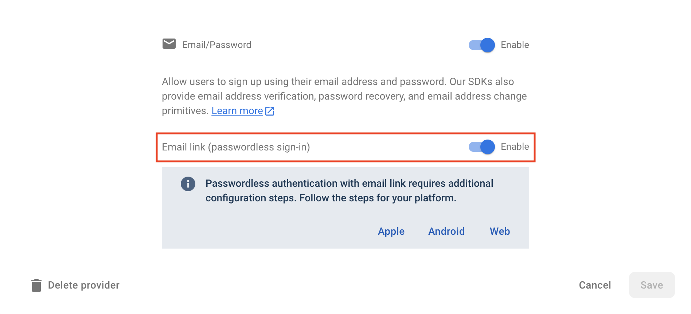

# Firebase UI Email Link provider

## Configuration

To support Email link as a provider, first ensure that the "Email link" is enabled under "Email/Password" provider
in the [Firebase Console](https://console.firebase.google.com/project/_/authentication/providers):



Configure email provider:

```dart
import 'package:firebase_core/firebase_core.dart';
import 'package:firebase_ui_auth/firebase_ui_auth.dart';

import 'firebase_options.dart';

void main() {
  WidgetsFlutterBinding.ensureInitialized();
  await Firebase.initializeApp(options: DefaultFirebaseOptions.currentPlatform);

  FirebaseUIAuth.configureProviders([
    EmailLinkAuthProvider(
      actionCodeSettings: ActionCodeSettings(
        url: 'https://<your-project-id>.page.link',
        handleCodeInApp: true,
        androidMinimumVersion: '1',
        androidPackageName:
            'io.flutter.plugins.firebase_ui.firebase_ui_example',
        iOSBundleId: 'io.flutter.plugins.flutterfireui.flutterfireUIExample',
      ),
    ),
    // ... other providers
  ]);
}
```

See [this doc](https://firebase.google.com/docs/auth/flutter/email-link-auth) for more info about `ActionCodeSettings`.

## Using screen

After adding `EmailLinkAuthProvider` to the `FirebaseUIAuth.configureProviders`, `SignInScreen` or `RegisterScreen` will have a button that will trigger `EmailLinkSignInAction`, or, if no action provided, will open `EmailLinkSignInScreen` using `Navigator.push`.

```dart
MaterialApp(
  initialRoute: '/login',
  routes: {
    '/login': (context) {
      return SignInScreen(
        actions: [
          EmailLinkSignInAction((context) {
            Navigator.pushReplacementNamed(context, '/email-link-sign-in');
          }),
        ],
      );
    },
    '/email-link-sign-in': (context) => EmailLinkSignInScreen(
      actions: [
        AuthStateChangeAction((context, state) {
          if (state is SignedIn || state is UserCreated) {
            Navigator.pushReplacementNamed(context, '/profile');
          }
        }),
      ],
    ),
    '/profile': (context) => ProfileScreen(),
  }
)
```

> Notes:
>
> - a user signing in with an email link for the first time emits `UserCreated` rather than `SignedIn`, so handle both.
> - see [navigation guide](../navigation.md) to learn how navigation works with Firebase UI.
> - explore [FirebaseUIActions API docs](https://pub.dev/documentation/firebase_ui_auth/latest/firebase_ui_auth/FirebaseUIAction-class.html).

## Handling the sign in link

When the link is sent, the email is stored on the device, so the link completes the sign in even if the app was killed in the meantime.

- **Link opens the app:** `EmailLinkSignInScreen` completes the sign in with the link that launched the app. Show it on startup when `isLaunchedFromSignInLink` is true:

  ```dart
  final launchedFromSignInLink =
      await emailLinkProvider.isLaunchedFromSignInLink();

  MaterialApp(
    initialRoute: launchedFromSignInLink ? '/email-link-sign-in' : '/login',
    // ...
  );
  ```

  Disable Flutter's built-in deep linking so it does not replace `initialRoute` with the link: add `<meta-data android:name="flutter_deeplinking_enabled" android:value="false" />` to the `<activity>` in `AndroidManifest.xml` (not the `<application>`), and set `FlutterDeepLinkingEnabled` to `false` in `Info.plist`.

- **Link opened while the app is running:** the link is handled by the email link screen. If that screen is not showing, the link is kept until it opens, so open `EmailLinkSignInScreen` yourself when a link arrives, for example from an `app_links` listener when `FirebaseAuth.instance.isSignInWithEmailLink(link)` is true and the screen is not already open.
- **Link opened on another device:** the flow emits `EmailRequired` and `EmailLinkSignInView` asks the user to confirm their email before signing in.
- **Anonymous users:** by default an anonymous user is replaced by the signed in user. Pass `upgradeAnonymousUsers: true` to `EmailLinkAuthProvider` to link the email to the anonymous user instead: the flow then emits `CredentialLinked` instead of `SignedIn`, the link must be opened on the same device (otherwise sign in fails with an `email-link-wrong-device` error), and an email that already has an account cannot be used.

## Using view

If the pre-built screen don't suit the app's needs, you could use a `EmailLinkSignInView` to build your custom screen:

```dart
class MyEmailLinkSignInScreen extends StatelessWidget {
  @override
  Widget build(BuildContext) {
    return Scaffold(
      body: Column(
        children: [
          MyCustomHeader(),
          Expanded(
            child: Padding(
            padding: const EdgeInsets.all(16),
              child: FirebaseUIActions(
                actions: [
                  AuthStateChangeAction((context, state) {
                    if (state is SignedIn || state is UserCreated) {
                      Navigator.pushReplacementNamed(context, '/profile');
                    }
                  }
                ],
                child: EmailLinkSignInView(provider: emailLinkAuthProvider),
              ),
            ),
          ),
        ]
      )
    )
  }
}
```

## Building a custom widget with `AuthFlowBuilder`

You could also use `AuthFlowBuilder` to facilitate the functionality of the `EmailLinkFlow`:

```dart
class MyCustomWidget extends StatelessWidget {
  @override
  Widget build(BuildContext context) {
    return AuthFlowBuilder<EmailLinkAuthController>(
      provider: emailLinkProvider,
      listener: (oldState, newState, ctrl) {
        if (newState is SignedIn || newState is UserCreated) {
          Navigator.of(context).pushReplacementNamed('/profile');
        }
      }
      builder: (context, state, ctrl, child) {
        if (state is Uninitialized) {
          return TextField(
            decoration: InputDecoration(label: Text('Email')),
            onSubmitted: (email) {
              ctrl.sendLink(email);
            },
          );
        } else if (state is AwaitingDynamicLink) {
          return CircularProgressIndicator();
        } else if (state is EmailRequired) {
          // The link was opened on another device.
          return TextField(
            decoration: InputDecoration(label: Text('Confirm your email')),
            onSubmitted: (email) {
              ctrl.confirmEmail(email);
            },
          );
        } else if (state is AuthFailed) {
          return ErrorText(exception: state.exception);
        } else {
          return Text('Unknown state $state');
        }
      },
    );
  }
}
```

## Building a custom stateful widget

For full control over every phase of the authentication lifecycle you could build a stateful widget, which implements `EmailLinkAuthListener`:

```dart
class CustomEmailLinkSignIn extends StatefulWidget {
  const CustomEmailLinkSignIn({super.key});

  @override
  State<CustomEmailLinkSignIn> createState() => _CustomEmailLinkSignInState();
}

class _CustomEmailLinkSignInState extends State<CustomEmailLinkSignIn>
    implements EmailLinkAuthListener {
  final auth = FirebaseAuth.instance;
  late final EmailLinkAuthProvider provider =
      EmailLinkAuthProvider(actionCodeSettings: actionCodeSettings)
        ..authListener = this;

  late Widget child = TextField(
    decoration: const InputDecoration(
      labelText: 'Email',
    ),
    onSubmitted: provider.sendLink,
  );

  @override
  void initState() {
    super.initState();
    // Completes the sign in if a sign in link launched the app.
    provider.handleIncomingLinks();
  }

  @override
  void onBeforeLinkSent(String email) {
    setState(() {
      child = CircularProgressIndicator();
    });
  }

  @override
  void onLinkSent(String email) {
    provider.awaitLink(email);
    setState(() {
      child = Text('Check your email and click the link');
    });
  }

  @override
  void onEmailRequired(String link) {
    setState(() {
      child = TextField(
        decoration: const InputDecoration(
          labelText: 'Confirm your email',
        ),
        onSubmitted: (email) => provider.signInWithLink(email, link),
      );
    });
  }

  @override
  Widget build(BuildContext context) {
    return Center(child: child);
  }

  @override
  void onBeforeCredentialLinked(AuthCredential credential) {
    setState(() {
      child = CircularProgressIndicator();
    });
  }

  @override
  void onBeforeProvidersForEmailFetch() {
    setState(() {
      child = CircularProgressIndicator();
    });
  }

  @override
  void onBeforeSignIn() {
    setState(() {
      child = CircularProgressIndicator();
    });
  }

  @override
  void onCanceled() {
    setState(() {
      child = Text('Authenticated cancelled');
    });
  }

  @override
  void onCredentialLinked(AuthCredential credential) {
    Navigator.of(context).pushReplacementNamed('/profile');
  }

  @override
  void onDifferentProvidersFound(
      String email, List<String> providers, AuthCredential? credential) {
    showDifferentMethodSignInDialog(
      context: context,
      availableProviders: providers,
      providers: FirebaseUIAuth.providersFor(FirebaseAuth.instance.app),
    );
  }

  @override
  void onError(Object error) {
    try {
      // tries default recovery strategy
      defaultOnAuthError(provider, error);
    } catch (err) {
      setState(() {
        defaultOnAuthError(provider, error);
      });
    }
  }

  @override
  void onSignedIn(UserCredential credential) {
    Navigator.of(context).pushReplacementNamed('/profile');
  }
}
```
