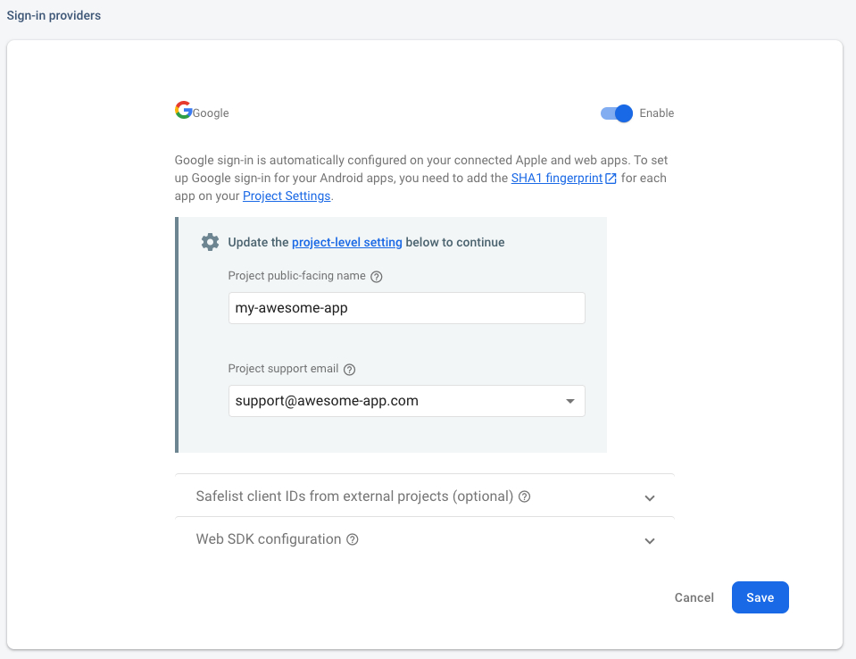
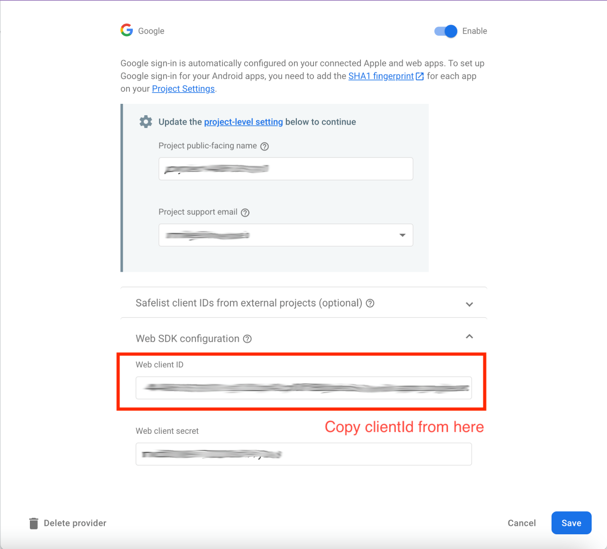
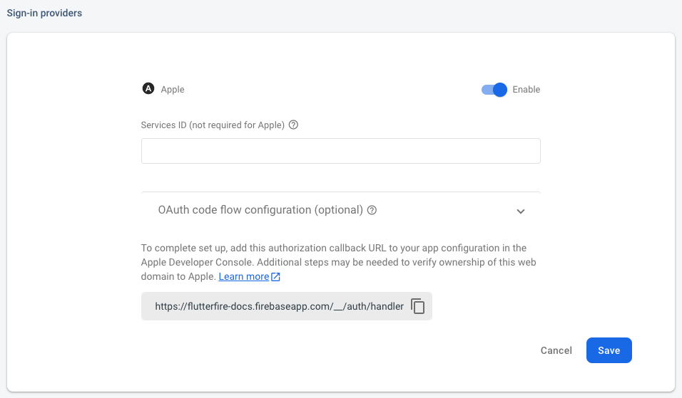
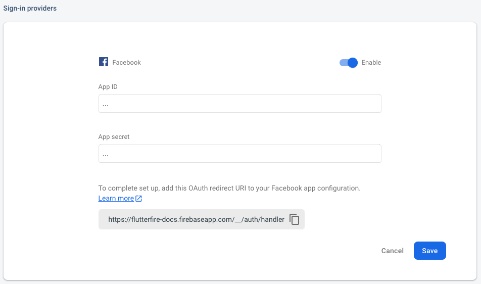
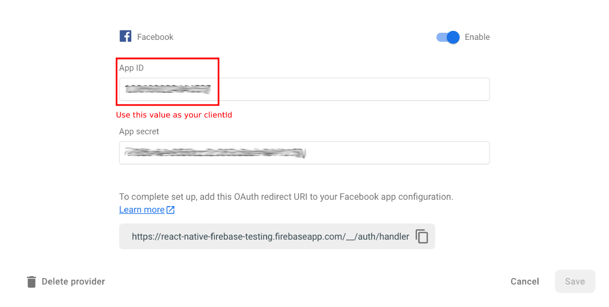
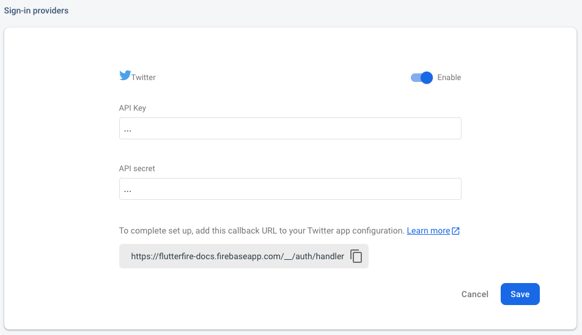
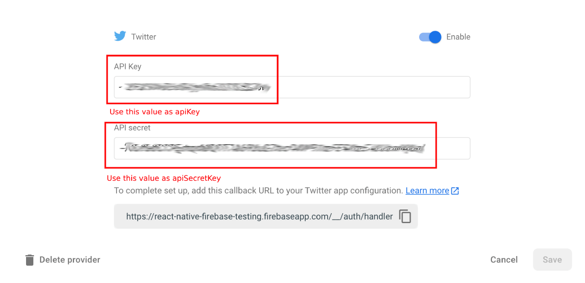

# Firebase UI OAuth

## Google Sign In

To support Google as a provider, first install the official [`google_sign_in`](https://pub.dev/packages/google_sign_in) plugin to your project as described in the README.

❗️ Important: you need go through configuration steps for each platform as described on the [README](https://pub.dev/packages/google_sign_in).

Next, enable the "Google" provider in the Firebase Console:



> To ensure cross-platform support, please ensure you have followed installation instructions for both the `google_sign_in` package and the provider on the Firebase Console (such as adding a [SHA1 fingerprint](https://developers.google.com/android/guides/client-auth?authuser=0) for Android applications).

You will also need to install [`firebase_ui_oauth_google`](https://pub.dev/packages/firebase_ui_oauth_google):

```sh
flutter pub add firebase_ui_oauth_google
```

And add a provider to the configuration:

```dart
Future<void> main() async {
  WidgetsFlutterBinding.ensureInitialized();
  await Firebase.initializeApp(options: DefaultFirebaseOptions.currentPlatform);

  FirebaseUIAuth.configureProviders([
    GoogleProvider(clientId: GOOGLE_CLIENT_ID),
  ]);
}
```

Now all pre-built screens that support multiple providers (such as `RegisterScreen`, `SignInScreen`, `ProfileScreen` and others) will have a themed button.

The configuration requires the `clientId` property (which can be found in the Firebase Console) to be set for seamless cross-platform support.

For iOS and macOS, `clientId` can be found in the `GoogleService-Info.plist` file available in the Firebase console under Firebase project settings.

For example, if your `GoogleService-Info.plist` looks like this:

```xml
<?xml version="1.0" encoding="UTF-8"?>
<!DOCTYPE plist PUBLIC "-//Apple//DTD PLIST 1.0//EN" "http://www.apple.com/DTDs/PropertyList-1.0.dtd">
<plist version="1.0">
<dict>
  <key>CLIENT_ID</key>
  <string>your-client-id.apps.googleusercontent.com</string>
  <!-- more keys -->
</dict>
```

you should set `clientId` to `your-client-id.apps.googleusercontent.com`:

```dart
GoogleProvider(clientId: 'your-client-id.apps.googleusercontent.com'),
```

Additionally, you need to add the following to your `Info.plist` file:

```xml
<key>CFBundleURLTypes</key>
<array>
  <dict>
    <key>CFBundleTypeRole</key>
    <string>Editor</string>
    <key>CFBundleURLSchemes</key>
    <array>
      <string>com.googleusercontent.apps.your-client-id</string>
    </array>
  </dict>
</array>
```

For Linux and Windows, `clientId` should be set to a web client id:



```dart
const iOSClientId = 'your-client-id.apps.googleusercontent.com';
const webClientId = 'your-web-client-id.apps.googleusercontent.com';

String get googleClientId {
  return switch (defaultTargetPlatform) {
    TargetPlatform.iOS || TargetPlatform.macOS => iOSClientId,
    _ => webClientId,
  }
}
```

See [Custom screens section](#custom-screens) to learn how to use a button on your custom screen.

## Sign in with Apple

To support Apple as a provider, enable the "Apple" provider in the Firebase Console:



You will also need to install [`firebase_ui_oauth_apple`](https://pub.dev/packages/firebase_ui_oauth_apple):

```sh
flutter pub add firebase_ui_oauth_apple
```

And add a provider to the configuration:

```dart
Future<void> main() async {
  WidgetsFlutterBinding.ensureInitialized();
  await Firebase.initializeApp(options: DefaultFirebaseOptions.currentPlatform);

  FirebaseUIAuth.configureProviders([
    AppleProvider(),
  ]);
}
```

Now all pre-built screens that support multiple providers (such as `RegisterScreen`, `SignInScreen`, `ProfileScreen` and others) will have a themed button. See [Custom screens section](#custom-screens) to learn how to use a button on your custom screen.

## Flutter Facebook Auth

To support Facebook as a provider, first install the [`flutter_facebook_auth`](https://pub.dev/packages/flutter_facebook_auth)
plugin to your project. Each platform requires that you follow the [installation process](https://facebook.meedu.app) as specified
in the documentation.

Next, enable the "Facebook" provider in the Firebase Console & provide your created Facebook App ID and secret:



You will also need to install [`firebase_ui_oauth_facebook`](https://pub.dev/packages/firebase_ui_oauth_facebook):

```sh
flutter pub add firebase_ui_oauth_facebook
```

And add a provider to the configuration:

```dart
Future<void> main() async {
  WidgetsFlutterBinding.ensureInitialized();
  await Firebase.initializeApp(options: DefaultFirebaseOptions.currentPlatform);

  FirebaseUIAuth.configureProviders([
    FacebookProvider(clientId: FACEBOOK_CLIENT_ID),
  ]);
}
```

Now all pre-built screens that support multiple providers (such as `RegisterScreen`, `SignInScreen`, `ProfileScreen` and others) will have a themed button.

The configuration requires the `clientId` property (which can be found in the Firebase Console) to be set for seamless cross-platform support.



See [Custom screens section](#custom-screens) to learn how to use a button on your custom screen.

## Twitter Login

Enable the "Twitter" provider in the Firebase Console, and give it the API key and secret from your
app in the [X developer portal](https://developer.twitter.com/en/portal/projects-and-apps):





Then set the "Callback URL" of that same X app to the Firebase auth handler, which the Firebase
Console shows when you enable the provider:

```
https://<your-project-id>.firebaseapp.com/__/auth/handler
```

Install [`firebase_ui_oauth_twitter`](https://pub.dev/packages/firebase_ui_oauth_twitter):

```sh
flutter pub add firebase_ui_oauth_twitter
```

And add the provider to the configuration:

```dart
Future<void> main() async {
  WidgetsFlutterBinding.ensureInitialized();
  await Firebase.initializeApp(options: DefaultFirebaseOptions.currentPlatform);

  FirebaseUIAuth.configureProviders([
    TwitterProvider(),
  ]);
}
```

Now all pre-built screens that support multiple providers (such as `RegisterScreen`, `SignInScreen`, `ProfileScreen` and others) will have a themed button.

### Android and iOS setup

On Android and iOS, Firebase performs the sign in itself, so the API key and secret stay in the
Firebase Console and are never shipped in your app.

On **iOS**, add your encoded app ID as a URL scheme in `ios/Runner/Info.plist`. You will find it in
the Firebase Console under Project settings, listed as the App ID for your iOS app, with `:`
replaced by `-`:

```xml
<key>CFBundleURLTypes</key>
<array>
  <dict>
    <key>CFBundleTypeRole</key>
    <string>Editor</string>
    <key>CFBundleURLSchemes</key>
    <array>
      <string>app-1-1234567890-ios-0a1b2c3d4e5f6g7h8i9j</string>
    </array>
  </dict>
</array>
```

On **Android**, add your app's SHA-1 fingerprint in the Firebase Console under Project settings, so
Firebase can verify the sign in request.

### macOS and Windows setup

Firebase does not support this sign in flow on macOS or Windows, so on those platforms
`firebase_ui_oauth_twitter` performs the OAuth 1.0a flow itself and does need the API key and
secret:

```dart
TwitterProvider(
  apiKey: TWITTER_API_KEY,
  apiSecretKey: TWITTER_API_SECRET_KEY,
),
```

They are ignored on Android, iOS and the web. On a platform that needs them, sign in fails with a
`FirebaseAuthException` rather than proceeding with empty credentials, so an absent
`--dart-define` surfaces as a clear error.

Because the secret is embedded in desktop builds, pass it at build time rather than committing it:

```bash
flutter run --dart-define TWITTER_SECRET=<your-twitter-api-secret-key>
```

```dart
apiSecretKey: String.fromEnvironment('TWITTER_SECRET'),
```

### Upgrading from 2.x

Version 3.0.0 moves Twitter sign in on Android and iOS from the `twitter_login` package to
Firebase's own provider flow. Your code keeps compiling, but sign in fails at runtime on those two
platforms until you update the configuration below. macOS, Windows and the web are unaffected.

#### What you must change

1. **Callback URL.** In the [X developer portal](https://developer.twitter.com/en/portal/projects-and-apps),
   set your app's Callback URL to the Firebase auth handler:

   ```
   https://<your-project-id>.firebaseapp.com/__/auth/handler
   ```

   X accepts several callback URLs, so you can add this alongside the custom scheme you use today
   and keep an older build of your app working while you roll out.

2. **iOS.** Add your encoded app ID as a URL scheme in `ios/Runner/Info.plist`, as described in the
   setup section above. Without it, the sign in sheet completes but never returns to your app.

3. **Android.** Register your app's SHA-1 fingerprint in the Firebase Console, then **re-download
   `google-services.json`**. Adding the fingerprint alone is not enough, because the certificate
   hash is embedded in that file when you download it. If you skip either step, sign in fails with:

   ```
   There was an error while trying to get your package certificate hash.
   ```

4. **Remove `twitter_login`** from your `pubspec.yaml` if you depended on it directly, along with
   the callback intent filter it required in `AndroidManifest.xml`.

5. **`apiKey` and `apiSecretKey` are now optional.** Remove them unless you ship for macOS or
   Windows, which still perform the OAuth 1.0a flow in process and still need them. They are
   ignored on Android, iOS and the web.

#### Behaviour changes

Firebase signs the user in as part of returning the credential, which changes three things on
Android and iOS:

- `AuthAction.none` now fails with a `FirebaseAuthException` instead of handing you a credential
  without signing in. There is no way to obtain the credential without also creating a session.
- The credential passed to `onCredentialLinked` is a plain `AuthCredential` rather than an
  `OAuthCredential`. It carries no `secret` and cannot be cast to `OAuthCredential`.
- `redirectUri` is ignored. Firebase always completes through its own auth handler. It is still
  honoured on macOS and Windows.

Cancelling sign in returns you to the app silently, with no error shown, which matches the previous
behaviour.

#### Known limitation on Android

Firebase usually opens the sign in link in a Chrome Custom Tab inside your app's task, and
dismissing it returns to your app. Occasionally it opens the full browser in its own task instead.
If the user abandons the flow there, the pending operation never resolves and further attempts fail
with:

```
A headful operation is already in progress. Please wait for that to finish.
```

Restarting the app clears it. This comes from the Firebase Android SDK rather than
`firebase_ui_oauth_twitter`, and there is nothing the Dart layer can do about a sign in the SDK
never completes.

See [Custom screens section](#custom-screens) to learn how to use a button on your custom screen.

## Custom screens

If you want to use a button on your custom screen, use `OAuthProviderButton`:

```dart
class MyCustomScreen extends StatelessWidget {
  const MyCustomScreen({super.key});

  @override
  Widget build(BuildContext context) {
    return AuthStateListener<OAuthController>(
      child: OAuthProviderButton(
        // or any other OAuthProvider
        provider: GoogleProvider(clientId: GOOGLE_CLIENT_ID),
      ),
      listener: (oldState, newState, ctrl) {
        if (newState is SignedIn) {
          Navigator.pushReplacementNamed(context, '/profile');
        }
        return null;
      },
    );
  }
}
```
